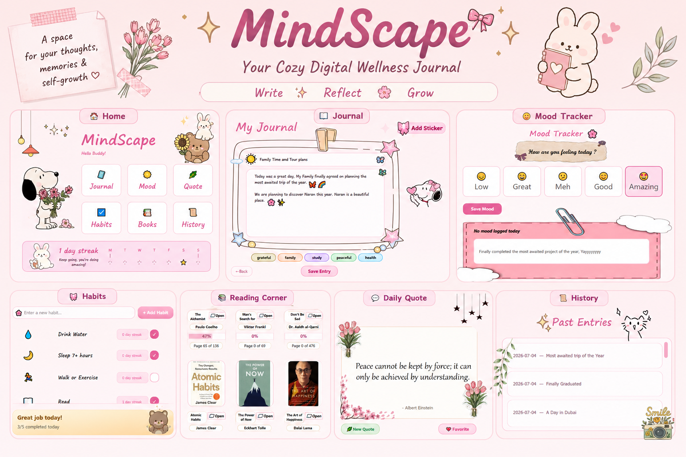
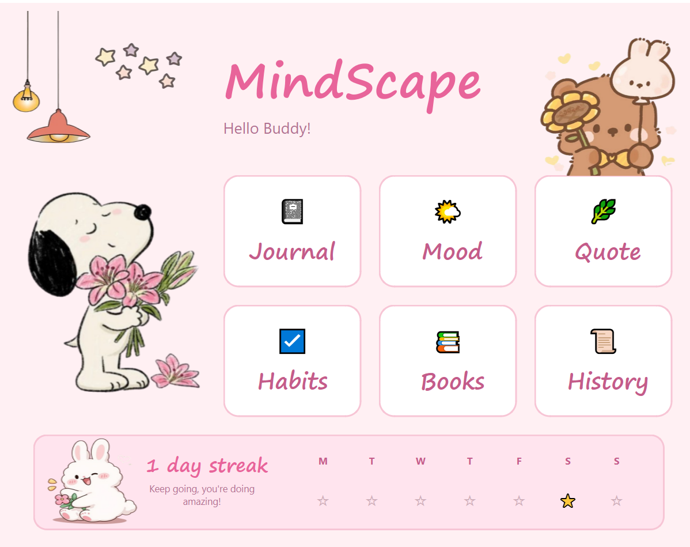
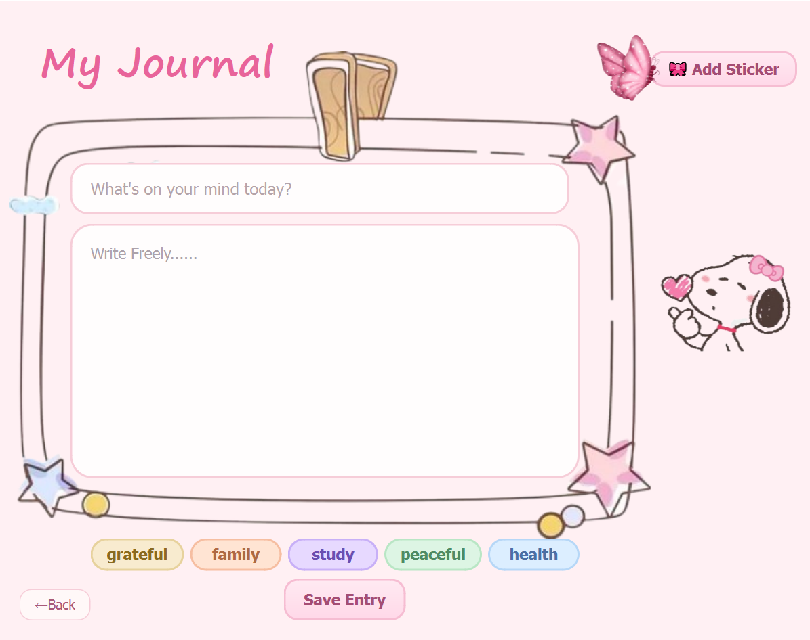
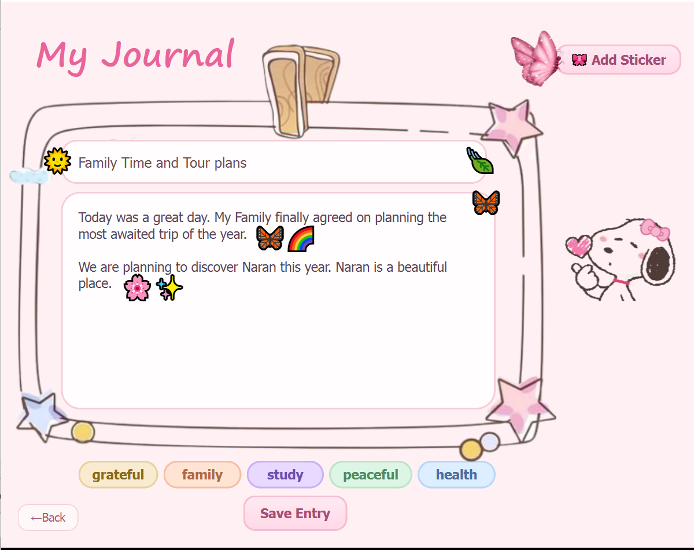
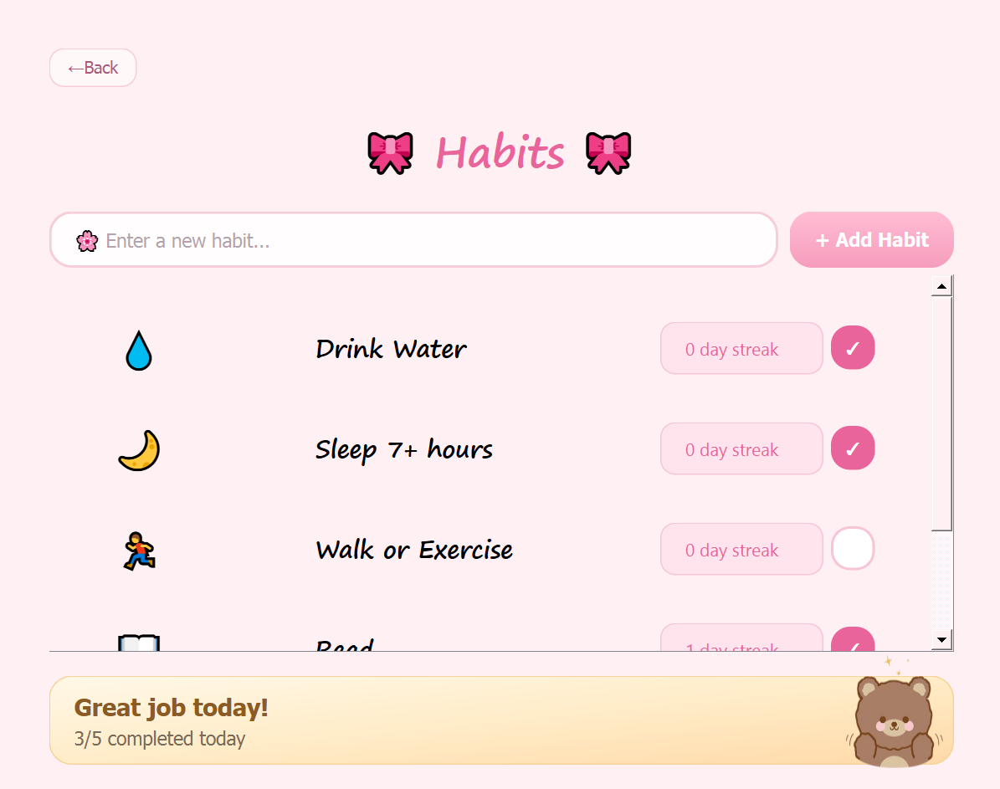
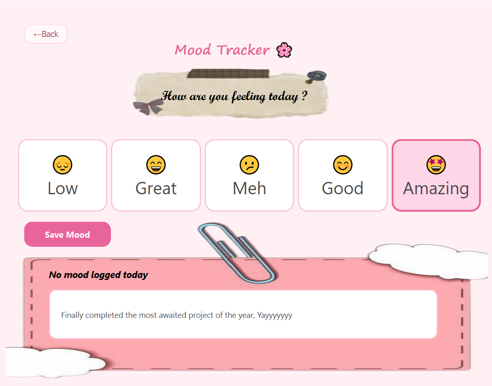
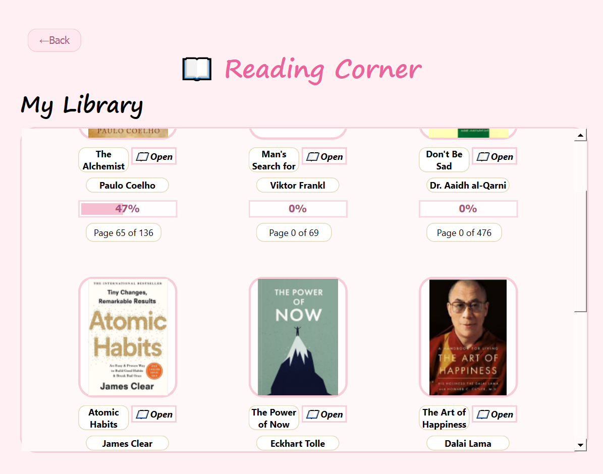

<p align="center">
  
</p>

<h1 align="center">🌸 MindScape 🌸</h1>

<p align="center">
A cozy desktop wellness journal built with <b>Qt (C++)</b> to help users reflect, organize thoughts, build healthy habits, and cultivate a peaceful daily routine.
</p>

<p align="center">

                      🌷 Journal • 📖 Reading Corner • 💖 Mood Tracker • 🌱 Habit Tracker • ✨ Quotes • 📚 History

</p>

---

# ✨ About

MindScape is a calming desktop application designed around the idea that journaling should feel warm, comforting, and aesthetically pleasing.

Instead of presenting plain forms and lists, the interface uses soft pastel colors, cozy decorations, illustrated elements, and custom-designed pages to create a relaxing digital journaling experience.

The application was built using **C++ and Qt Widgets**, with object-oriented design principles and persistent file storage.

---

# 🌼 Features

## 📝 Journal

- Create journal entries
- Rich text writing
- Entry titles
- Decorative draggable stickers
- Mood selection
- Tags
- Automatic saving
- Daily streak tracker

---

## 🌱 Habit Tracker

- Add custom habits
- Mark habits as completed
- Daily progress indicator
- Habit streak calculation
- Beautiful habit cards

---

## 💖 Mood Tracker

- Log daily mood
- Optional mood notes
- Simple emoji-based interface

---

## ✨ Quote Generator

- Random motivational quotes
- Favourite quote option
- Persistent quote storage

---

## 📚 Reading Corner

- Built-in personal library
- Beautiful book cards
- Reading progress tracker
- PDF launching support
- Progress saved automatically

---

## 📜 Journal History

- Browse previous entries
- Entry previews
- Tags
- Search-ready architecture
- Persistent storage

---

# 🖼 Screenshots

## 🏡 Home



---

## 📝 Journal



---

## ✍️ Writing Experience



---

## 🌱 Habit Tracker



---

## 💖 Mood Tracker



---

## ✨ Quotes


---

## 📚 Reading Corner



---

## 📜 History


---

# 🛠 Built With

- C++
- Qt Widgets
- Qt Designer
- Object-Oriented Programming
- File Handling
- Git
- GitHub

---

# 📂 Project Structure

```
MindScape
│
├── assets/
├── assets2/
├── data/
│
├── Appcontroller
├── EntryManager
├── JournalEntry
├── HabitManager
├── MoodManager
├── QuoteManager
│
├── MainWindow
├── BookCard
├── HabitCard
├── HistoryCard
├── StickerPicker
├── DraggableSticker
│
└── resources.qrc
```

---

# 💾 Data Storage

The application stores user data locally using text files.

- Journal Entries
- Habits
- Habit Logs
- Quotes
- Book Progress
- Mood Logs

---

# 🌸 Design Philosophy

MindScape was designed to make journaling feel less like filling out a form and more like writing inside a cozy personal diary.

The interface focuses on:

- Soft pastel colors
- Rounded cards
- Cozy illustrations
- Cute decorations
- Warm typography
- Calm layouts

to create an inviting digital space for reflection.

---

# 🚀 Getting Started

Clone the repository

```bash
git clone https://github.com/zaraaziz07/MindScape-Wellness-Journal.git
```

Open the project using **Qt Creator**.

Build using CMake.

Run the application.

---

# 🎯 Future Improvements

- User accounts
- Calendar view
- Cloud synchronization
- Themes (Dark / Light)
- Export journal entries as PDF
- Statistics dashboard
- Advanced search
- Password protection

---

# 👩‍💻 Developer

**Zara Aziz**

Computer Science Student

Passionate about creating aesthetic and meaningful software that combines functionality with beautiful user experiences.

---

<p align="center">

Made with 🌸, ☕ and countless late-night debugging sessions.

</p>
